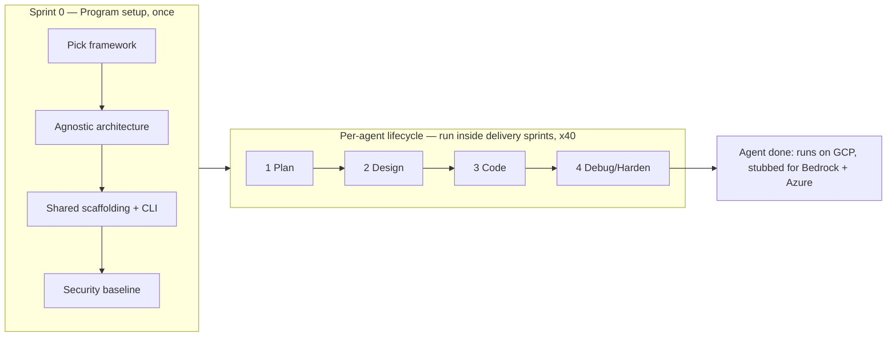
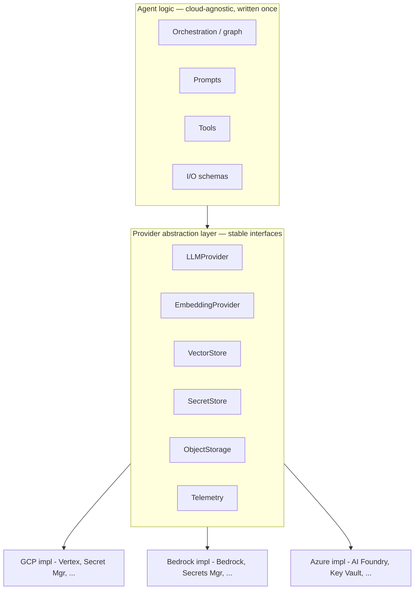
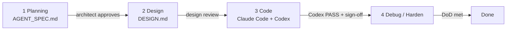

# AI Agent Platform — Project Playbook & Build Instructions

**Goal:** Build **40 cloud-agnostic AI agents** on a single (or near-single) framework. Deploy to **GCP first**, then **AWS Bedrock** and **Azure**, without rewriting the agents.

**Division of labor:** the **human owns architecture and decisions**, **Claude Code writes the bulk of the implementation**, and **Codex cross-verifies at checkpoints**. Work is sequenced through a phased per-agent lifecycle and delivered in **sprints** — the agents themselves are built sprint by sprint.

---

## 0. How to use this document

This is the **single source of truth** for the program. Read it as two layers:

- **Program layer** — set up *once* before the 40 agents (Section 3). Framework, the agnostic architecture, shared scaffolding, security baseline.
- **Per-agent layer** — repeated *40 times* (Section 4). The four-phase lifecycle each agent passes through, **executed inside sprints** (Section 5).

Practical recommendation: keep this file at the **root of the monorepo** as the project's living spec, and maintain a short companion file that Claude Code reads at the start of each coding session so it always has project context. (Claude Code's mechanics and project-context conventions are documented at https://docs.claude.com/en/docs/claude-code/overview — verify specifics there rather than from memory, since the tooling evolves.)

**The four phases:** 1) Planning → 2) Design → 3) Code → 4) Debug. Nothing in between.

---

## 1. The project in one picture



**The core thesis:** 40 agents is a *standardization* problem, not 40 separate projects. The leverage comes from doing the hard thinking once — one framework, one abstraction layer, one scaffold, one set of gates — and then stamping out agents against that template, sprint by sprint. Resist the urge to make each agent bespoke.

---

## 2. Operating principles (non-negotiables)

1. **Agnostic by construction, not by retrofit.** Build the cloud/provider abstraction on day one even though only the GCP implementation is wired first. Retrofitting portability after 40 agents are written is the expensive failure mode.
2. **Spec before code.** No agent enters the Code phase without an approved spec and design. The gates exist to protect the human's architecture from drift.
3. **Two-AI verification.** Claude Code builds, Codex independently reviews at checkpoints, the human arbitrates. Two different models catch different classes of mistakes.
4. **Eval-gated, not vibe-gated.** "It looks right" is not a pass. Every agent has a measurable eval threshold it must clear.
5. **Least privilege everywhere.** Agents touch real systems and data. Every agent runs with the narrowest identity and scopes that let it do its job.
6. **One template to rule them all.** New agents are generated from the scaffold, never hand-rolled from scratch.

---

## 3. Program setup — Sprint 0 (do this once)

Everything in this section is built **before** the first production agent. The output of Sprint 0 is: a chosen framework, a working abstraction layer, a scaffolding generator, a security baseline, and **one reference ("golden") agent** that proves the whole pipeline end-to-end.

### 3.1 Framework selection

You haven't picked the framework yet, so make it a deliberate, recorded decision rather than a default.

**Decide first:** are the 40 agents *independent* (40 separate tools), or a *multi-agent system* (agents that call each other / are orchestrated together)? This changes framework needs. The lifecycle and abstraction below work for both; a multi-agent system additionally needs an orchestration/registry layer and inter-agent contracts.

**Score candidates against these criteria** (weight to taste):

| Criterion | Why it matters here |
|---|---|
| Provider/model agnosticism | Highest weight — you must move GCP → Bedrock → Azure without rewrites |
| Maturity & community | Fewer dead ends across a multi-quarter, 40-agent effort |
| Observability / tracing | You need traces, token/cost metrics across all 40 |
| State & memory model | Agents need conversation/task state that survives provider swaps |
| Tool / function-calling abstraction | Tools should be defined once, run on any provider |
| Multi-agent support | Only if the answer to the question above is "system" |
| Per-cloud deployment story | Must containerize and run on Cloud Run / ECS-Fargate / Container Apps |
| Testing & eval support | Gates depend on this |
| License & lock-in risk | Avoid anything that hard-couples you to one cloud |

**Shortlist to evaluate** (honest tradeoffs, not endorsements — score them yourself):

- **LangGraph (LangChain)** — graph-based orchestration, large ecosystem, strong tracing via LangSmith. Heavier; ecosystem churn.
- **Pydantic AI** — lightweight, type-safe, provider-neutral. Newer, smaller ecosystem.
- **CrewAI** — role/crew abstraction, good if you lean multi-agent. More opinionated.
- **Google ADK (Agent Development Kit)** — clean, but carries some GCP gravity; weigh against your agnostic requirement.
- **AutoGen (Microsoft) / Semantic Kernel** — strong multi-agent / Azure-leaning respectively; watch for provider pull.

**Model-routing layer (orthogonal to the framework):** put a provider router such as **LiteLLM** (or your own thin client) *underneath* the framework so model calls hit GCP/Bedrock/Azure through one interface. Many frameworks support this directly; if yours doesn't, the router is your abstraction.

**A reasonable safe-default stack** if you want a starting point to evaluate against: *LangGraph for orchestration + LiteLLM for provider routing + Pydantic for I/O schemas + OpenTelemetry for tracing*, with **Pydantic AI** evaluated as the lighter alternative. This is a suggestion to test, not the decision.

**How to actually decide:** score the top 2 candidates, then build the *same tiny reference agent* in both. Pick the winner. **Record the choice and the reasoning in an ADR** (template in Section 8). Standardize on **one** framework to maximize reuse; only allow a second if a specific agent class genuinely demands it.

### 3.2 The cloud-agnostic architecture

The whole portability story rests on **separating the agent's brain from the infrastructure**.



Rules that make this real:

- **The agent logic imports the abstraction interfaces, never a cloud SDK directly.** No `boto3` / `google.cloud.*` / `azure.*` import is allowed inside `agent/`. (Enforce this — see Section 9.)
- **Cloud is selected by config, not code.** A `CLOUD=gcp|bedrock|azure` config/env var picks the implementation at startup.
- **Wire GCP fully now; stub Bedrock and Azure at the interface.** The stubs must satisfy the interface and have interface-level tests, so "go agnostic later" is a config change plus filling in stubs, not a redesign.
- **Containerize everything (Docker).** The same image runs on any cloud's container runtime.
- **One IaC tool across all three.** Use **Terraform** with a shared module structure and per-cloud roots, so infra is portable too.
- **Cloud-neutral observability.** OpenTelemetry for traces, structured JSON logs, explicit token/cost metrics — so dashboards don't depend on the cloud.

**Hosting map** (verify current service names/capabilities in each provider's docs — these evolve, and your Jan-2026-era assumptions should be re-checked):

| Concern | GCP (first) | AWS Bedrock | Azure |
|---|---|---|---|
| Model inference | Vertex AI | Bedrock | Azure AI Foundry / Azure OpenAI |
| Run the container | Cloud Run | ECS Fargate (or Bedrock AgentCore-style runtime) | Container Apps |
| Secrets | Secret Manager | Secrets Manager | Key Vault |
| Identity | Service Accounts / Workload Identity | IAM roles | Managed Identities |
| Vector store | Vertex Vector Search / pgvector | OpenSearch / pgvector | Azure AI Search / pgvector |

> Tip: `pgvector` on managed Postgres is the most portable vector-store choice across all three clouds if you want to minimize per-cloud divergence.

### 3.3 Shared scaffolding

**Monorepo layout:**

```
agents-platform/
  packages/
    core/          # provider abstraction, base agent class, shared tools
    evals/         # shared eval harness + metrics
    cli/           # "new-agent" generator (cookiecutter-style)
  agents/
    agent-01-<name>/
    agent-02-<name>/
    ...
  infra/
    shared/        # registries, networking, observability backend
    gcp/ aws/ azure/
  docs/
  CLAUDE.md        # short project-context file for the coding agent
  README.md
```

**Per-agent layout** (what the generator stamps out):

```
agent-NN-<name>/
  agent/           # cloud-agnostic logic (NO cloud SDK imports)
  providers/       # thin wiring to packages/core abstractions
  config/          # base.yaml + gcp.yaml / bedrock.yaml / azure.yaml
  infra/           # terraform referencing shared modules
  tests/
    unit/
    integration/
    evals/         # this agent's eval suite + thresholds
  AGENT_SPEC.md    # Phase 1 output
  DESIGN.md        # Phase 2 output
  Dockerfile
  README.md        # includes a runbook
```

**The scaffolding CLI is the single most important reuse lever.** A `new-agent <name>` command that generates the skeleton above guarantees every one of the 40 agents starts identical: same structure, same abstraction wiring, same test/eval stubs, same CI hooks. Build it in Sprint 0 and never hand-create an agent again.

Also stand up in Sprint 0: CI (lint, type-check, unit tests, eval run, the "no cloud SDK in `agent/`" check), the shared eval harness, and the observability backend.

### 3.4 Access control & security baseline

Set these once as platform defaults so every agent inherits them.

- **Identity per cloud:** each agent runs as its own least-privilege service account / IAM role / managed identity. No shared "god" credentials.
- **Secrets:** never in code or images. Pulled at runtime from the cloud's secret store via the `SecretStore` abstraction.
- **Least-privilege scopes:** an agent gets read/write access to *only* the specific resources its use case requires.
- **Guardrails & prompt-injection defense:** input/output filtering, tool allow-lists, and treat all tool/data-returned content as untrusted (it can contain injected instructions). Agents that can *write* or take consequential actions get extra scrutiny.
- **Human-in-the-loop gates:** any sensitive or irreversible action requires explicit human approval before execution.
- **Audit logging:** every tool invocation and external action is logged with who/what/when.
- **Data governance:** classify the data each agent handles (esp. PII); note data-residency constraints early, since they affect *which* cloud an agent may run on.

---

## 4. The per-agent lifecycle (repeat for each of the 40)



Each phase has a **deliverable** and a **gate** (the human architect signs off before the next phase starts). The whole lifecycle is run **inside sprints** (Section 5) — agents are pulled into a sprint and taken through all four phases there.

### Phase 1 — Planning

**Deliverable:** `AGENT_SPEC.md` — a one-pager (template in Section 8) covering exactly the items you specified:

- **Use case / "what we're trying to do":** the specific job-to-be-done, the trigger, the user, the success definition. One paragraph, concrete.
- **ROI:** quantify it.
  - *Annual value* = (time saved per period × loaded hourly cost) + (rework/error-reduction value) + (revenue/throughput gain)
  - *Cost* = build cost (engineering + AI tooling) + annual run cost (inference + hosting + maintenance + monitoring)
  - *ROI* = (Annual value − Annual run cost) ÷ (Build cost + Annual run cost); *Payback* = Build cost ÷ monthly net value
- **Efficiency:** record a **baseline** (current process time/cost/quality) and a **target**. You'll measure the **actual** after launch and feed it back. An agent with no measurable efficiency gain shouldn't be built.
- **Architecture sketch:** components — model(s), tools, data sources, memory/state, orchestration shape. Note any reason it couldn't be agnostic (there usually isn't one).
- **Access control plan:** invokers, the identity it runs as, resources it may read/write, secrets it needs, which actions require human approval, audit requirements, data classification.
- **Requirements:**
  - *Functional* — what it must do.
  - *Non-functional* — latency (p50/p95), cost-per-request ceiling, accuracy/quality threshold (the eval bar), availability, throughput, compliance/data-residency, HITL needs.

**Gate:** architect approves the spec. ROI and efficiency targets are realistic; access-control plan is least-privilege.

### Phase 2 — Design

**Deliverable:** `DESIGN.md` — *how* you'll build this specific agent.

- Decompose the use case into the orchestration graph / step sequence.
- Define each **tool** (inputs, outputs, side effects, permissions) and each **data source**.
- Specify **memory/state**: what's remembered, where, for how long, and how it survives a provider swap.
- **Prompt strategy:** system prompt, key instructions, output schema.
- **Provider-neutral check:** confirm the design only touches clouds through the abstraction layer.
- **Eval plan:** datasets, metrics, and the pass thresholds this agent must clear (these become CI gates).
- **Sprint placement:** which sprint, dependencies on shared components.

**Gate:** design review. Approach is sound, agnostic, and the eval plan is concrete.

### Phase 3 — Code (Claude Code builds, Codex verifies)

This is the phase that's "mostly Claude Code, cross-verified by Codex at checkpoints."

1. **Generate the skeleton** with the scaffolding CLI — never hand-roll.
2. **Claude Code implements** against `AGENT_SPEC.md` + `DESIGN.md` + the shared `core` package. Give it the spec, the design, and the project-context file as inputs so it builds to the architecture, not around it. Use a plan-then-implement flow; have it write tests alongside code.
3. **Checkpoints** (lightweight — not every commit). Trigger Codex review at:
   - skeleton complete,
   - each major component done (providers wiring, tools, orchestration),
   - before merge to `main`,
   - end of sprint.
4. **Definition of Done** must be fully met (Section 6) before the agent leaves this phase.

> For **agent-01** (built during Sprint 0), this phase also produces the **golden template** the other 39 agents are patterned on — get it clean, because everything downstream copies it.

**Gate:** all checkpoint Codex reviews are PASS (or PASS-with-fixes that are then fixed), and the human architect signs off. See the verification protocol in Section 7.

### Phase 4 — Debug & Harden *(your max-effort phase)*

This is where you said you'd spend the most time — treat it as a first-class phase, not cleanup.

- **Fix eval failures and edge cases** until the agent clears its thresholds reliably, not just on average.
- **Adversarial testing:** prompt injection via tool/data outputs, malformed inputs, permission-boundary probing.
- **Multi-cloud parity check:** flip the config to the Bedrock/Azure stubs and confirm the interface contracts hold (full parity comes when those clouds go live; the contract must hold now).
- **Cost & latency tuning:** caching, model-tier selection, prompt trimming, retry/backoff behavior.
- **Observability validation:** traces, structured logs, and token/cost metrics are actually emitting and useful.

**Gate:** the full Definition of Done checklist passes; the agent is production-ready on GCP.

---

## 5. Sprint model

**Sprints are how the agents get made.** The entire per-agent lifecycle (Plan → Design → Code → Debug) is executed inside sprints: each sprint pulls in a batch of agents and runs them through all four phases to done. The sprint model is the wrapper around the whole agent factory, not just the design step.

**Cadence:** 2-week sprints (adjust to your team). Ceremonies adapt to the AI-assisted workflow:

- **Planning** — pick which agent(s) to build this sprint; write/approve their specs.
- **Daily check-in** — short; surface blockers and checkpoint findings.
- **Checkpoint reviews** — the Codex verification passes (Section 7), as they come up.
- **Sprint review** — demo finished agents (live, on GCP).
- **Retro** — and crucially, **improve the template/scaffold** based on what was painful.

**Sprint 0 is special:** it delivers the *platform* (framework decision, abstraction layer, scaffolding CLI, security baseline, CI/observability) **plus the golden agent (agent-01)**. Do not start the agent factory until Sprint 0's outputs exist.

**Velocity ramps.** Early agents are slow because you're still hardening the template; later agents are fast because they're near-copies. Illustrative roadmap (yours will differ):

| Sprint | Focus | Agents delivered |
|---|---|---|
| 0 | Platform + golden agent | 1 (agent-01) |
| 1 | Ramp + template hardening | 2–3 |
| 2 | Factory warming up | 4–6 |
| 3–10 | Steady state | ~4–5 / sprint |

At ~4–5 agents/sprint in steady state, the 40 land in roughly **10–11 sprints** after Sprint 0. Use this to set expectations, not as a commitment — quality gates set the real pace.

---

## 6. Definition of Done (consolidated gate, every agent)

- [ ] `AGENT_SPEC.md` approved by the architect (ROI, efficiency, access control, requirements)
- [ ] `DESIGN.md` reviewed and approved
- [ ] Lint + type-check + unit tests pass in CI
- [ ] Eval suite meets or exceeds its thresholds
- [ ] All Codex checkpoint reviews: PASS
- [ ] Security review done: secrets externalized, least privilege, injection guardrails, HITL on sensitive actions
- [ ] **Agnosticism check passes:** no cloud-SDK imports inside `agent/`; cloud chosen by config
- [ ] Runs on the **GCP** target; **Bedrock + Azure** configs stubbed with interface-level tests
- [ ] Observability live: traces, structured logs, token/cost metrics emitting
- [ ] `README` + runbook complete
- [ ] Human architect sign-off

---

## 7. The two-AI verification protocol (Claude Code ↔ Codex)

The point: **Claude Code and Codex have different blind spots; using one to check the other catches more.** The human is the arbiter, not a bystander.

**Roles**

- **Claude Code** — primary implementer. Writes code + tests against the approved spec and design.
- **Codex** — independent reviewer at checkpoints. Does *not* write the feature; it audits.
- **Human architect** — owns the architecture, resolves disagreements, gives final sign-off.

**What Codex checks at each checkpoint**

- Correctness against `AGENT_SPEC.md` / `DESIGN.md`
- Logic bugs and unhandled edge cases
- Security: hardcoded secrets, missing input validation, prompt-injection exposure, over-broad permissions
- **Agnosticism:** no cloud SDK leaking into `agent/`; all cloud access via the abstraction layer
- Error handling, retries, timeouts
- Tests present and meaningful; eval thresholds actually wired into CI
- Observability hooks present (tracing/logging/cost)
- Performance red flags
- Consistency with shared conventions

**Verdicts:** `PASS` · `PASS-with-fixes` (list required changes) · `FAIL` (must rework).

**Disagreements:** when Claude Code and Codex disagree, the **human decides** and **records the decision and rationale in the PR**. That log becomes institutional knowledge for the remaining agents.

**Keep it proportional:** checkpoints are at skeleton / major-component / pre-merge / end-of-sprint — not every commit. The goal is a quality gate, not a bottleneck.

---

## 8. Templates (copy per agent)

### 8.1 `AGENT_SPEC.md` (Phase 1)

```markdown
# Agent NN — <name>

## Use case (what we're trying to do)
<one concrete paragraph: trigger, user, job-to-be-done, success definition>

## ROI
- Annual value: <calc>
- Build cost: <calc>   Annual run cost: <calc>
- ROI: <value>   Payback: <months>

## Efficiency
- Baseline (today): <time/cost/quality>
- Target (with agent): <...>
- Actual (post-launch, fill later): <...>

## Architecture sketch
- Model(s): <...>  Tools: <...>  Data sources: <...>
- Memory/state: <...>  Orchestration shape: <...>
- Agnostic? <yes / reason if not>

## Access control
- Invokers: <...>  Runs as (identity): <...>
- Reads: <...>  Writes: <...>  Secrets: <...>
- HITL-gated actions: <...>  Audit: <...>  Data class: <...>

## Requirements
- Functional: <...>
- Non-functional: latency p50/p95 <...>, cost/req ceiling <...>,
  eval threshold <...>, availability <...>, compliance/residency <...>
```

### 8.2 `DESIGN.md` (Phase 2)

```markdown
# Agent NN — Design

## Orchestration / steps
<graph or step sequence>

## Tools
| Tool | Inputs | Outputs | Side effects | Permissions |

## Data sources & memory/state
<what, where, retention, provider-swap behavior>

## Prompt strategy
<system prompt, key instructions, output schema>

## Provider-neutral check
<confirm cloud access only via abstraction layer>

## Eval plan
- Datasets: <...>  Metrics: <...>  Thresholds (CI gates): <...>

## Sprint placement
- Sprint: <...>  Dependencies: <...>
```

### 8.3 Codex checkpoint review checklist

```markdown
# Codex Review — Agent NN — <checkpoint>
- [ ] Matches AGENT_SPEC / DESIGN
- [ ] Logic / edge cases
- [ ] Security: secrets, input validation, injection, permissions
- [ ] Agnosticism: no cloud SDK in agent/; config-driven cloud
- [ ] Error handling, retries, timeouts
- [ ] Tests + eval thresholds wired
- [ ] Observability hooks present
- [ ] Performance red flags
- [ ] Conventions consistent

Verdict: PASS / PASS-with-fixes / FAIL
Required changes: <...>
```

### 8.4 ADR (architecture decision record)

```markdown
# ADR-NNN: <decision>
Date: <...>   Status: <proposed/accepted/superseded>
Context: <the question and constraints>
Options considered: <A / B / C with tradeoffs>
Decision: <what and why>
Consequences: <follow-on effects, what this locks in>
```

---

## 9. Risks & watch-items

- **Agnostic drift** (cloud calls sneaking into agent logic) — the top risk. Enforce mechanically: a lint/import rule that fails CI on cloud-SDK imports inside `agent/`, plus the Codex agnosticism check, plus an architecture test.
- **Framework lock-in** — keep agent logic thin and the model layer abstracted, so a framework change is survivable.
- **Cost runaway across 40 agents** — per-agent cost ceilings (from the spec), a central cost dashboard, and caching.
- **Prompt injection / tool abuse** — guardrails, tool allow-lists, treat tool/data output as untrusted, HITL on writes.
- **Eval rot** — version eval datasets and re-run them in CI so quality doesn't silently regress.
- **Scope creep × 40** — the spec gate and template discipline are what keep this from becoming 40 snowflakes.
- **Stale cloud assumptions** — cloud service names/features change; re-verify the hosting map against current provider docs before each new cloud goes live.

---

## Appendix — glossary

- **Golden / reference agent** — the first fully-built agent (agent-01) that the other 39 are patterned on.
- **Provider abstraction layer** — the set of interfaces (LLM, embeddings, vector store, secrets, storage, telemetry) that isolate agent logic from any specific cloud.
- **ADR** — a short record of an architectural decision and its reasoning.
- **DoD** — Definition of Done; the gate every agent must clear.
